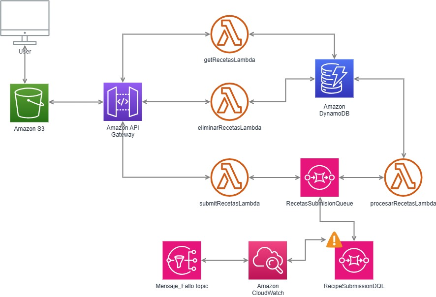
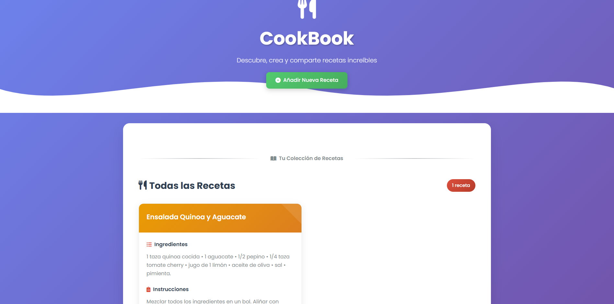
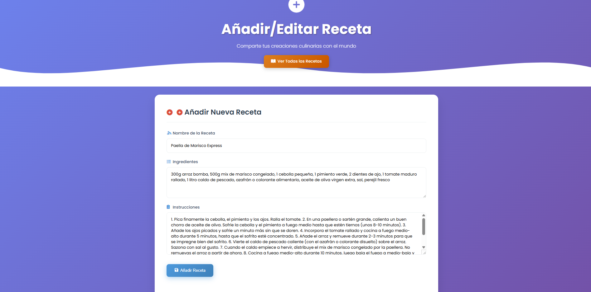
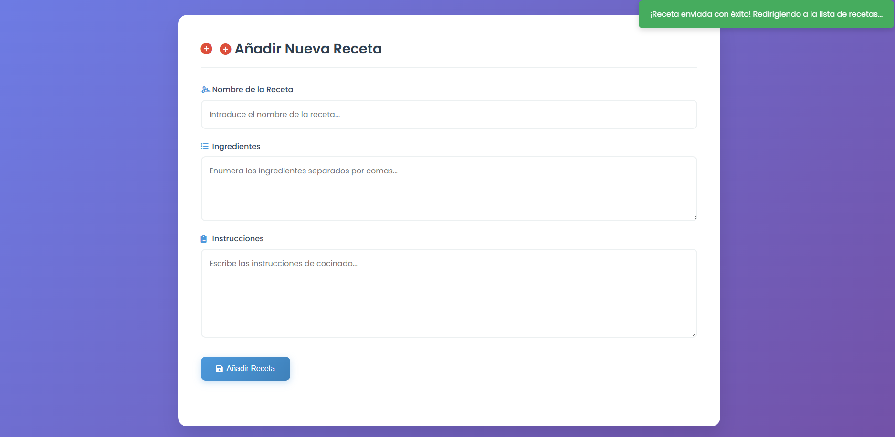
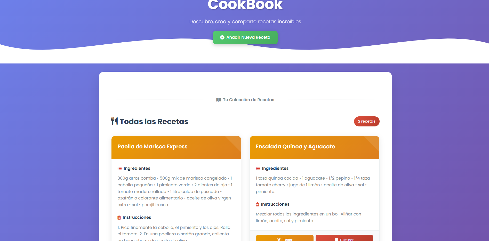

# Descripción funcional y técnica del proyecto: Cookbook

Este documento proporciona un resumen funcional y técnico detallado del proyecto "Cookbook", una aplicación web serverless diseñada para la gestión pública de recetas. Se añade también un archivo PASOS PARA LA IMPLEMENTACIÓN DEL PROYECTO COOKBOOK.pdf con los pasos de la implementación en la consola de AWS, además de un archivo template.yaml con la plantilla de ClouFormation que se utilizaría para automatizar el despiegue de la solución.

## 0. Link a la web

[Cookbook (an AWS hosted cooking website)](https://recetas-frontend-immune.s3.us-east-1.amazonaws.com/frontend/index.html)

## 1. Descripción funcional

"Cookbook" es una aplicación web que sirve como un directorio público de recetas. Permite a cualquier usuario interactuar con una colección compartida de recetas sin necesidad de autenticación.

**Funcionalidades principales:**

* **Visualización de recetas:** Los usuarios pueden ver una lista de todas las recetas disponibles en la página principal. Cada receta se muestra en una tarjeta con un resumen.

* **Añadir nuevas recetas:** Los usuarios pueden acceder a un formulario dedicado para introducir los detalles de una nueva receta y añadirla al directorio.

* **Editar recetas existentes:** Los usuarios pueden seleccionar una receta de la lista o desde la página de detalle para precargar sus datos en el formulario de edición y realizar modificaciones.

* **Eliminar recetas:** Los usuarios pueden borrar recetas del directorio directamente desde la lista o desde la página de detalle.

* **Manejo de errores y alertas:** La aplicación cuenta con mecanismos para manejar errores en el procesamiento de mensajes. Si un mensaje no puede ser procesado y termina en la Dead-Letter Queue (DLQ), el sistema envía notificaciones de alerta(por correo electrónico) a un administrador.

## 2. Descripción técnica (Arquitectura Serverless)

La aplicación "Cookbook" está construida sobre una arquitectura **serverless y basada en eventos** en Amazon Web Services (AWS). Esto significa que no hay servidores que provisionar o gestionar, y la infraestructura escala automáticamente según la demanda.

**Componentes de AWS utilizados:**

* **Amazon S3 (Simple Storage Service):**

    * **Rol:** Alojamiento del frontend estático (archivos HTML, CSS, JavaScript).

    * **Detalles:** Un bucket S3 está configurado para *hosting* de sitios web estáticos, accesible públicamente. Los archivos del frontend se cargan directamente desde aquí.

    * **Seguridad:** Cifrado en reposo (SSE-S3) por defecto, durabilidad de 11 nueves. Acceso público de lectura configurado mediante políticas de bucket para el *hosting* web.

* **Amazon API Gateway:**

    * **Rol:** Punto de entrada único para todas las solicitudes HTTP/HTTPS del frontend. Actúa como una API REST que enruta las solicitudes a las funciones Lambda correspondientes.

    * **Detalles:** Define los *endpoints* (`/recetas`, `/recetas/{idReceta}`) y métodos HTTP (GET, POST, PUT, DELETE). Utiliza Integración Proxy de Lambda para pasar la solicitud HTTP completa a las Lambdas. Se configura CORS para permitir la comunicación entre el frontend y el backend.

    * **Seguridad:** HTTPS/TLS por defecto, protección DDoS básica (AWS Shield Standard). Actualmente, no tiene autenticación/autorización de usuario.

* **AWS Lambda:**

    * **Rol:** Ejecuta la lógica de negocio del backend de forma serverless.

    * **Detalles:** Todas las funciones están escritas en **Python**.

        * `submitRecipeLambda`: Maneja las solicitudes `POST` y `PUT`. Valida los datos de la receta y envía la carga útil (payload) a una cola SQS para procesamiento asíncrono.

        * `processRecipeLambda`: Activada por SQS. Procesa el mensaje de la receta, realiza las operaciones de escritura/actualización en DynamoDB. La funcionalidad de publicación de notificaciones SNS tras cada creación/actualización de receta ha sido eliminada.

        * `getRecipesLambda`: Maneja las solicitudes `GET`. Recupera una o todas las recetas de DynamoDB.

        * `deleteRecipeLambda`: Maneja las solicitudes `DELETE`. Elimina una receta de DynamoDB.

    * **Seguridad:** Entornos de ejecución aislados, parches gestionados por AWS. Los permisos se otorgan a través de Roles de IAM.

* **Amazon SQS (Simple Queue Service):**

    * **Rol:** Cola de mensajes para desacoplar el proceso de recepción de solicitudes del procesamiento de datos en la base de datos.

    * **Detalles:** `RecipeSubmissionQueue` es la cola principal. Los mensajes de receta se envían aquí para ser procesados por `processRecipeLambda`.

    * **Seguridad:** Cifrado en reposo (SSE-SQS) y en tránsito (HTTPS/TLS).

    * **Manejo de Errores:** Configurada con una Dead-Letter Queue (DLQ), `RecipeSubmissionDLQ`, a la que se mueven los mensajes si `processRecipeLambda` falla repetidamente.

* **Amazon SNS (Simple Notification Service):**

    * **Rol:** Servicio de publicación/suscripción para enviar notificaciones.

    * **Detalles:** Ya no se utiliza para notificar cada creación/actualización de receta. Su uso principal ahora es como destino para las alarmas de CloudWatch, enviando alertas cuando hay mensajes en la DLQ.

    * **Seguridad:** Cifrado en reposo (SSE-SNS) y en tránsito (HTTPS/TLS).

* **Amazon DynamoDB:**

    * **Rol:** Base de datos NoSQL de alto rendimiento para almacenar los datos de las recetas.

    * **Detalles:** Se utiliza una tabla `Recetas` con `idReceta` como clave primaria.

    * **Seguridad:** Cifrado en reposo (Always-On con AWS KMS) y en tránsito (HTTPS/TLS).

* **Amazon CloudWatch:**

    * **Rol:** Servicio de monitoreo y observabilidad.

    * **Detalles:** Recopila logs de todas las funciones Lambda. Se configura una alarma para la `RecipeSubmissionDLQ` que notifica (vía SNS) si hay mensajes fallidos en la cola de mensajes muertos, alertando sobre problemas en el procesamiento.

* **AWS IAM (Identity and Access Management):**

    * **Rol:** Gestiona de forma segura el acceso a los recursos de AWS.

    * **Detalles:** Se utilizan roles de IAM para definir los permisos de ejecución de las funciones Lambda, permitiéndoles interactuar con SQS, SNS y DynamoDB.

## 3. Conceptos y patrones arquitectónicos

* **Serverless:** Elimina la gestión de servidores, escalando automáticamente y pagando solo por el uso.

* **Arquitectura basada en eventos:** Los componentes se comunican a través de eventos (invocaciones de Lambda, mensajes SQS/SNS), lo que promueve el desacoplamiento.

* **Procesamiento asíncrono:** El uso de SQS permite que la API responda rápidamente al usuario mientras el procesamiento de la receta ocurre en segundo plano, mejorando la experiencia del usuario y la resiliencia.

* **Patrón Publicación/Suscripción:** SNS permite que múltiples suscriptores reciban notificaciones de eventos sin que el publicador necesite conocerlos directamente.

* **Manejo robusto de errores:** La DLQ y las alarmas de CloudWatch proporcionan un mecanismo para capturar, inspeccionar y ser alertado sobre mensajes que no pueden ser procesados.

* **Infraestructura como código (IaC - Potencial):** Aunque no se implementó explícitamente en los pasos, esta arquitectura es ideal para ser definida y desplegada usando herramientas IaC como AWS SAM o Serverless Framework.

## 4. Alta disponibilidad (HA)

La arquitectura serverless proporciona una alta disponibilidad inherente a nivel de Zona de Disponibilidad (AZ):

* **Multi-AZ por defecto:** Servicios como S3, API Gateway, Lambda, SQS, SNS y DynamoDB son inherentemente Multi-AZ. AWS gestiona automáticamente la replicación y el *failover* dentro de una región, asegurando que si una AZ falla, la aplicación sigue operativa.

# Buenas prácticas implementadas en el proyecto "Cookbook"

El proyecto "Cookbook" ha sido diseñado y construido siguiendo diversas buenas prácticas en el desarrollo de aplicaciones serverless en AWS, enfocándose en la eficiencia, escalabilidad, resiliencia y mantenibilidad.

## 1. Arquitectura serverless

* **Abstracción de servidores:** Al utilizar servicios como AWS Lambda, API Gateway, SQS, SNS y DynamoDB, se elimina la necesidad de provisionar, escalar o gestionar servidores. 

* **Pago por uso:** Se adopta un modelo de pago por consumo (pay-per-use), donde solo se paga por los recursos utilizados (invocaciones de Lambda, lecturas/escrituras de DynamoDB, mensajes SQS/SNS, etc.). Esto optimiza los costes.

* **Escalabilidad automática:** Todos los servicios serverless utilizados escalan automáticamente para satisfacer la demanda, sin intervención manual. Esto asegura que la aplicación pueda manejar picos de tráfico sin problemas de rendimiento.

## 2. Desacoplamiento y resiliencia

* **Patrón de mensajería asíncrona (SQS):**

    * La introducción de **Amazon SQS** entre `submitRecetaLambda` y `procesarRecetaLambda` desacopla el frontend/API del proceso de escritura en la base de datos. Esto mejora la resiliencia (si DynamoDB o `procesarRecetaLambda` tienen un problema temporal, los mensajes se retienen en la cola y se reintentan) y la experiencia de usuario (la API responde rápidamente sin esperar la escritura en DB).

    * **Dead-Letter Queue (DLQ):** La configuración de `RecipeSubmissionDLQ` es una práctica esencial para el manejo de errores. Los mensajes que no pueden ser procesados después de un número configurable de reintentos se mueven a la DLQ, evitando bucles infinitos y permitiendo su posterior análisis y reprocesamiento.

* **Patrón Publicar/Suscribir (SNS para Alertas):** Aunque no se usa para notificaciones de creación/actualización de recetas, el uso de **Amazon SNS** para las alarmas de la DLQ demuestra el patrón Pub/Sub. Permite que múltiples suscriptores (ej. correos electrónicos, otras Lambdas) reciban alertas sin que el publicador (CloudWatch) necesite conocerlos directamente.

## 3. Seguridad

* **Modelo de responsabilidad compartida:** Se entiende que AWS gestiona la "seguridad de la nube" (infraestructura subyacente), mientras que el proyecto se enfoca en la "seguridad en la nube" (configuración de los servicios).

* **HTTPS/TLS por defecto:** Todas las comunicaciones entre servicios (frontend a API Gateway, Lambdas a DynamoDB/SQS/SNS) se realizan a través de HTTPS/TLS, garantizando el cifrado de datos en tránsito.

* **Cifrado en reposo:** Servicios como S3, DynamoDB, SQS y SNS cifran automáticamente los datos en reposo, protegiendo la información almacenada.

* **Roles de IAM para privilegio mínimo (Future Steps):** Aunque en el proyecto se usaron políticas de "FullAccess" para simplificar, se ha destacado la importancia de refinar los **Roles de IAM** de las funciones Lambda para adherirse al **Principio de privilegio mínimo**. Esto significa otorgar solo los permisos estrictamente necesarios para que cada Lambda realice su función, reduciendo la superficie de ataque. (Esto sería ideal en una solución en producción aunque no se haya podido implementar por la imposibilidad de crear roles.)

* **CORS:** Configurado explícitamente en API Gateway para permitir que el frontend acceda a la API de forma segura desde un origen diferente.

## 4. Observabilidad y monitoreo

* **Logs centralizados (CloudWatch Logs):** Todas las funciones Lambda envían automáticamente sus logs a CloudWatch Logs, facilitando la depuración, el monitoreo y la auditoría del comportamiento de la aplicación.

* **Métricas (CloudWatch Metrics):** Se utilizan las métricas integradas de AWS (ej. `ApproximateNumberOfMessagesVisible` para SQS) para monitorear el estado de la aplicación.

* **Alarmas proactivas (CloudWatch Alarms):** Se configura una alarma en CloudWatch para la DLQ. Esto proporciona una notificación proactiva (vía SNS) a los administradores si hay mensajes fallidos, permitiendo una rápida respuesta a los problemas.

## 5. Mantenibilidad y despliegue

* **Infraestructura como código (IaC - CloudFormation/SAM):**

    * Toda la infraestructura del backend (Lambdas, API Gateway, DynamoDB, SQS, SNS, CloudWatch Alarms) está definida en un único archivo `template.yaml` (CloudFormation/SAM). Esto permite:

        * **Automatización:** Desplegar y actualizar la infraestructura de forma automatizada y consistente.

        * **Versionado:** La infraestructura se versiona junto con el código de la aplicación.

        * **Replicabilidad:** Facilita la creación de entornos idénticos (desarrollo, pruebas, producción).

        * **Auditoría:** Los cambios en la infraestructura son visibles en el control de versiones.

* **Separación de responsabilidades (Frontend/Backend):** El proyecto mantiene una clara separación entre el frontend (archivos estáticos en S3) y el backend (API Gateway, Lambdas, DB, mensajería). Esto facilita el desarrollo, despliegue y escalado independiente de cada capa.

* **Código modular (Lambdas):** Cada función Lambda tiene una responsabilidad única y bien definida (`submit`, `process`, `get`, `delete`), lo que mejora la claridad del código, la mantenibilidad y la capacidad de depuración.

Al seguir estas buenas prácticas, el proyecto "Cookbook" no solo es funcional, sino que también establece una base sólida para futuras expansiones y operaciones en un entorno de producción.

## 6. Flujo de funcionamiento (Ejemplo: añadir nueva receta)

Para comprender cómo interactúan los componentes, veamos el flujo paso a paso cuando un usuario añade una nueva receta a través del frontend:

0. **Acceder a la web**

1.  **Interacción del usuario (Frontend en S3):**

    * El usuario navega a la página "Añadir Nueva Receta" (`add-edit.html`) en el navegador.

    * Rellena el formulario con el nombre, ingredientes e instrucciones de la receta.

    * Hace clic en el botón "Añadir Receta".

2.  **Envío de solicitud (Frontend a API Gateway):**

    * El código JavaScript (`form-script.js`) del frontend captura los datos del formulario.

    * Realiza una solicitud `POST` HTTP al *endpoint* `/recetas` de tu **API Gateway**. El cuerpo de la solicitud contiene los datos de la receta en formato JSON.

3.  **Recepción de solicitud (API Gateway a `submitRecetaLambda`):**

    * **API Gateway** recibe la solicitud `POST /recetas`.

    * Gracias a la **Integración Proxy de Lambda**, API Gateway invoca a la función **`submitRecetaLambda`**, pasándole el evento HTTP completo (incluyendo el cuerpo de la solicitud como una cadena JSON).

4.  **Envío a cola ( `submitRecetaLambda` a SQS):**

    * **`submitRecetaLambda`** extrae la cadena JSON de los datos de la receta del cuerpo del evento de API Gateway.

    * Realiza una validación básica de los campos de la receta.

    * Envía esta cadena JSON de la receta como un mensaje a la cola **Amazon SQS (`RecipeSubmissionQueue`)**.

    * Inmediatamente, `submitRecetaLambda` devuelve una respuesta `202 Accepted` a **API Gateway**, que a su vez la envía al frontend. Esto hace que la interfaz de usuario responda rápidamente, sin esperar a que la receta se guarde en la base de datos.

5.  **Procesamiento asíncrono (SQS a `procesarRecetaLambda`):**

    * **Amazon SQS** recibe el mensaje y lo pone en la cola.

    * La cola SQS actúa como un disparador para la función **`procesarRecetaLambda`**. SQS invoca a esta Lambda, pasándole el mensaje de la receta.

6.  **Guardado en base de datos ( `procesarRecetaLambda` a DynamoDB):**

    * **`procesarRecetaLambda`** parsea la cadena JSON del mensaje de SQS para obtener los datos de la receta como un diccionario Python.

    * Si la receta es nueva, genera un `idReceta` único. Si es una actualización, utiliza el `idReceta` existente.

    * Guarda (o actualiza) el ítem de la receta en la tabla **Amazon DynamoDB (`Recipes`)**.

    * Si el procesamiento es exitoso, `procesarRecetaLambda` finaliza su ejecución.

7.  **Manejo de fallos (DLQ y CloudWatch Alarm):**

    * Si **`procesarRecetaLambda`** falla repetidamente al procesar un mensaje (debido a un error en el código, datos malformados, o problemas temporales de DynamoDB), **SQS** reintentará entregar el mensaje un número predefinido de veces (`maxReceiveCount`).

    * Si todos los reintentos fallan, SQS mueve el mensaje a la **Dead-Letter Queue (`RecipeSubmissionDLQ`)**.

    * La presencia de mensajes en la `RecipeSubmissionDLQ` dispara una **alarma de CloudWatch**.

    * La alarma de CloudWatch envía una notificación a un tema **Amazon SNS**, que a su vez envía un correo electrónico de alerta a la dirección de correo electrónico del administrador.

8.  **Actualización del frontend:**

    * Después de recibir la respuesta `202 Accepted`, el frontend muestra un mensaje de éxito.

    * Tras un breve retraso (para permitir que el procesamiento asíncrono se complete), el frontend recarga la lista de recetas para mostrar la nueva receta añadida.

9.  **Visualización de la nueva receta ( `getRecetasLambda`):**

    * Al recargar la página principal, el código JavaScript (`script.js`) del frontend realiza una nueva solicitud `GET` al *endpoint* `/recetas` de API Gateway.

    * API Gateway invoca a la función `getRecetasLambda`.

    * `getRecetasLambda` lee todas las recetas (incluida la recién añadida) de la tabla Amazon DynamoDB (`Recipes`) y las devuelve a API Gateway, que a su vez las envía al frontend.

    * El frontend actualiza la interfaz de usuario, mostrando la nueva receta en el listado.

Este flujo demuestra el poder del desacoplamiento y el procesamiento asíncrono para construir aplicaciones serverless robustas y responsivas.

Este proyecto sirve como una base sólida para entender y construir aplicaciones serverless en AWS, demostrando patrones y servicios fundamentales para el desarrollo moderno en la nube. Se incluye el archivo template.yaml con la plantilla de CloudFormation que sería necesaria para desplegar el proyecto de 0, aunque no se ha podido probar porque incluye la creación de roles, a lo cual no tenemos permisos.